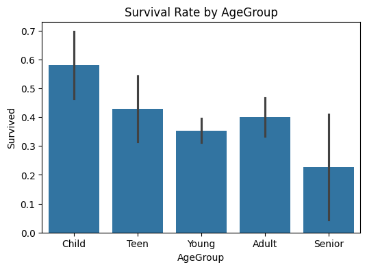

```python
import pandas as pd
import matplotlib.pyplot as plt
import seaborn as sns

print(pd.__version__)
print("Hello Titanic!")

```

    2.3.3
    Hello Titanic!
    


```python
#방법 1

import pandas as pd
url = "https://raw.githubusercontent.com/datasciencedojo/datasets/refs/heads/master/titanic.csv"
df = pd.read_csv(url)
# df = pd.read_csv("data/train.csv")
df.head()
df.shape
df.info()
df.isnull().sum().sort_values(ascending=False)
```

    <class 'pandas.core.frame.DataFrame'>
    RangeIndex: 891 entries, 0 to 890
    Data columns (total 12 columns):
     #   Column       Non-Null Count  Dtype  
    ---  ------       --------------  -----  
     0   PassengerId  891 non-null    int64  
     1   Survived     891 non-null    int64  
     2   Pclass       891 non-null    int64  
     3   Name         891 non-null    object 
     4   Sex          891 non-null    object 
     5   Age          714 non-null    float64
     6   SibSp        891 non-null    int64  
     7   Parch        891 non-null    int64  
     8   Ticket       891 non-null    object 
     9   Fare         891 non-null    float64
     10  Cabin        204 non-null    object 
     11  Embarked     889 non-null    object 
    dtypes: float64(2), int64(5), object(5)
    memory usage: 83.7+ KB
    


    Cabin          687
    Age            177
    Embarked         2
    PassengerId      0
    Name             0
    Pclass           0
    Survived         0
    Sex              0
    Parch            0
    SibSp            0
    Fare             0
    Ticket           0
    dtype: int64


```python
#방법 2

df = pd.read_csv("train.csv")
df.head()   #로딩 성공 여부 확인
df.shape    #데이터 규모 파악(행=샘플 수, 열=특성 수)
df.info()   #자료형/결측치 확인 → 전처리 방향 결정 / 결측치(특히 Age, Cabin 등)가 보이면 “전처리 필요”가 확정
df.isnull().sum().sort_values(ascending=False)

```

    <class 'pandas.core.frame.DataFrame'>
    RangeIndex: 891 entries, 0 to 890
    Data columns (total 12 columns):
     #   Column       Non-Null Count  Dtype  
    ---  ------       --------------  -----  
     0   PassengerId  891 non-null    int64  
     1   Survived     891 non-null    int64  
     2   Pclass       891 non-null    int64  
     3   Name         891 non-null    object 
     4   Sex          891 non-null    object 
     5   Age          714 non-null    float64
     6   SibSp        891 non-null    int64  
     7   Parch        891 non-null    int64  
     8   Ticket       891 non-null    object 
     9   Fare         891 non-null    float64
     10  Cabin        204 non-null    object 
     11  Embarked     889 non-null    object 
    dtypes: float64(2), int64(5), object(5)
    memory usage: 83.7+ KB
    


    Cabin          687
    Age            177
    Embarked         2
    PassengerId      0
    Name             0
    Pclass           0
    Survived         0
    Sex              0
    Parch            0
    SibSp            0
    Fare             0
    Ticket           0
    dtype: int64


```python
##결측치 처리 & 정리
df["Age"] = df["Age"].fillna(df["Age"].median())    #Age 중앙값 → 극단값 영향 ↓ (안정적)
df["Embarked"] = df["Embarked"].fillna(df["Embarked"].mode()[0])    #Embarked 최빈값 → 가장 흔한 항구 선택(단순하고 직관적)


##불필요한 컬럼 제거 (처리 난이도가 높은 열은 빼고 간단히)
drop_cols = ["PassengerId", "Name", "Ticket", "Cabin"]  #Cabin은 결측치가 많아서 제외
df = df.drop(columns=drop_cols) #Name/Ticket은 고급 피처 엔지니어링에서 다룸(초급 생략)

#결측치 처리는 모델 성능과 안정성에 큰 영향
```


```python
###범주형 → 숫자형
##One-hot encoding
#왜? 머신러닝 모델은 숫자만 입력 → 문자형을 0/1 컬럼으로 변환
df_encoded = pd.get_dummies(df, columns=["Sex", "Embarked"], drop_first=True)
df_encoded.head() 

#범주형 → 수치형 변환은 모델 입력 조건 때문에 필요

#결과 : Sex_male, Embarked_S 같은 0/1 열이 생기며 / 
#모델이 “남성/여성”, “탑승항” 정보를 숫자로 학습할 수 있게 됨
```


<div>
<style scoped>
    .dataframe tbody tr th:only-of-type {
        vertical-align: middle;
    }

    .dataframe tbody tr th {
        vertical-align: top;
    }

    .dataframe thead th {
        text-align: right;
    }
</style>
<table border="1" class="dataframe">
  <thead>
    <tr style="text-align: right;">
      <th></th>
      <th>Survived</th>
      <th>Pclass</th>
      <th>Age</th>
      <th>SibSp</th>
      <th>Parch</th>
      <th>Fare</th>
      <th>Sex_male</th>
      <th>Embarked_Q</th>
      <th>Embarked_S</th>
    </tr>
  </thead>
  <tbody>
    <tr>
      <th>0</th>
      <td>0</td>
      <td>3</td>
      <td>22.0</td>
      <td>1</td>
      <td>0</td>
      <td>7.2500</td>
      <td>True</td>
      <td>False</td>
      <td>True</td>
    </tr>
    <tr>
      <th>1</th>
      <td>1</td>
      <td>1</td>
      <td>38.0</td>
      <td>1</td>
      <td>0</td>
      <td>71.2833</td>
      <td>False</td>
      <td>False</td>
      <td>False</td>
    </tr>
    <tr>
      <th>2</th>
      <td>1</td>
      <td>3</td>
      <td>26.0</td>
      <td>0</td>
      <td>0</td>
      <td>7.9250</td>
      <td>False</td>
      <td>False</td>
      <td>True</td>
    </tr>
    <tr>
      <th>3</th>
      <td>1</td>
      <td>1</td>
      <td>35.0</td>
      <td>1</td>
      <td>0</td>
      <td>53.1000</td>
      <td>False</td>
      <td>False</td>
      <td>True</td>
    </tr>
    <tr>
      <th>4</th>
      <td>0</td>
      <td>3</td>
      <td>35.0</td>
      <td>0</td>
      <td>0</td>
      <td>8.0500</td>
      <td>True</td>
      <td>False</td>
      <td>True</td>
    </tr>
  </tbody>
</table>
</div>


```python
###기본 시각화 (EDA)
#1. 생존 카운트
plt.figure(figsize=(6,4))
sns.countplot(x="Survived", data=df)
plt.title("Survived Count")
plt.show()

#2. 성별 생존 비교
plt.figure(figsize=(6,4))
sns.countplot(x="Sex", hue="Survived", data=df)
plt.title("Survival by Sex")
plt.show()

#3. 좌석 등급 생존 비교
sns.countplot(x="Pclass", hue="Survived", data=df)
plt.title("Survival by Pclass")
plt.show()

#시각화를 통해 어떤 변수가 생존 여부에 영향이 있는지 시각적 패턴 확인
#EDA로 패턴을 눈으로 확인 → 나중에 모델 설계 방향 잡음
```


    

    


    

    


    

    


* 성별/등급별로 생존 분포가 다르면 → “규칙이 있다”는 신호
* 이 신호를 기반으로 EDA에서 “가설”을 세울 수 있음

**6) 통계가 필요한 이유 — EDA와 모델 평가의 핵심**

**1) 해당 단계가 필요한 이유**

데이터 분석은 “그럴듯한 이야기”가 아니라,

**숫자로 근거를 확인하고 판단**하는 일이기 때문이다.

통계는 크게 두 곳에서 바로 쓰인다.

- **(A) EDA 관점**:
    - “여성이 더 생존했을까?” 같은 질문을 **비율/평균/분포/그룹 비교**로 확인한다.
- **(B) 모델 성능 평가 관점**:
    - 모델이 잘 학습했는지 **정확도/정밀도/재현율 같은 지표**로 측정한다.


```python
###통계 기반 확인

#1. 전체 생존률     / 생존률 = 0/1 평균이라는 사실 체험
df["Survived"].mean()


```


    np.float64(0.3838383838383838)


```python
#2. 그룹별 생존률(비율 비교)
df.groupby("Sex")["Survived"].mean()
df.groupby("Pclass")["Survived"].mean()

#0/1 변수 평균 = 생존률(비율) ###
```


    Pclass
    1    0.629630
    2    0.472826
    3    0.242363
    Name: Survived, dtype: float64


```python
#3. 분포(나이 분포) 간단히 보기
plt.figure(figsize=(6,4))
sns.histplot(df["Age"], bins=20, kde=True)
plt.title("Age Distribution")
plt.show()
```


    

    


**결과 의미(해설)**

- Survived는 0/1이므로 평균이 곧 생존률이다.
    - 예: 0.38이면 “전체 생존률 약 38%”
- 그룹별 평균 비교는 “성별/등급이 영향이 있는지”를 가장 쉽게 보여준다.
- 분포(히스토그램)는 “어느 구간에 데이터가 몰려 있는지”를 보여주며

전처리(이상치/결측치) 판단에도 도움이 된다.

*핵심 메시지:*
***통계는 EDA에서 “근거를 만드는 도구”이고, 모델 평가에서 “성능을 재는 자”다.***

 + EDA 맛보기 — 가설 세우고 숫자로 확인

* EDA는 모델 전에 “데이터가 어떤 특징을 갖는지” 이해하는 단계.
* 좋은 가설은 좋은 피처 선택으로 이어짐

가설 예시:

**여성 생존률이 더 높다1등석 생존률이 더 높다어린이는 생존률이 높을 수 있다**

- 여성 생존률이 더 높다
- 1등석 생존률이 더 높다
- 어린이는 생존률이 높을 수 있다


```python
# ###파생 변수 만들기
##나이구간
df["AgeGroup"] = pd.cut(
    df["Age"],
    bins=[0, 12, 18, 35, 60, 100],

    labels=["Child", "Teen", "Young", "Adult", "Senior"]
)
df.groupby("AgeGroup")["Survived"].mean()
```

    C:\Users\user\AppData\Local\Temp\ipykernel_7816\549538728.py:9: FutureWarning: The default of observed=False is deprecated and will be changed to True in a future version of pandas. Pass observed=False to retain current behavior or observed=True to adopt the future default and silence this warning.
      df.groupby("AgeGroup")["Survived"].mean()
    


    AgeGroup
    Child     0.579710
    Teen      0.428571
    Young     0.353271
    Adult     0.400000
    Senior    0.227273
    Name: Survived, dtype: float64


```python
#간단 시각화
plt.figure(figsize=(6,4))
sns.barplot(x="AgeGroup", y="Survived", data=df)
plt.title("Survival Rate by AgeGroup")
plt.show()
#연령 구간별 생존률 확인 → 경험적으로 의미 있는 특성 생성
```


    

    


- EDA는 “감”이 아니라 “가설→숫자 확인”의 반복임.
- 이런 결과를 보고 “이 변수는 예측에 도움 될 것 같다”를 판단


```python
###학습/테스트 분리 + 모델 학습
##분리
from sklearn.model_selection import train_test_split

X = df_encoded.drop(columns=["Survived"])
y = df_encoded["Survived"]

X_train, X_test, y_train, y_test = train_test_split(
    X, y, test_size=0.2, random_state=42, stratify=y
)


##모델 학습(로지스틱 회귀분석)
from sklearn.linear_model import LogisticRegression

model = LogisticRegression(max_iter=1000)
model.fit(X_train, y_train)

##train/test 분리를 통해 공부용과 시험용 데이터 구별(과적합 방지에 중요함!)
```


[](url)
<style>#sk-container-id-5 {
  /* Definition of color scheme common for light and dark mode */
  --sklearn-color-text: #000;
  --sklearn-color-text-muted: #666;
  --sklearn-color-line: gray;
  /* Definition of color scheme for unfitted estimators */
  --sklearn-color-unfitted-level-0: #fff5e6;
  --sklearn-color-unfitted-level-1: #f6e4d2;
  --sklearn-color-unfitted-level-2: #ffe0b3;
  --sklearn-color-unfitted-level-3: chocolate;
  /* Definition of color scheme for fitted estimators */
  --sklearn-color-fitted-level-0: #f0f8ff;
  --sklearn-color-fitted-level-1: #d4ebff;
  --sklearn-color-fitted-level-2: #b3dbfd;
  --sklearn-color-fitted-level-3: cornflowerblue;
}

#sk-container-id-5.light {
  /* Specific color for light theme */
  --sklearn-color-text-on-default-background: black;
  --sklearn-color-background: white;
  --sklearn-color-border-box: black;
  --sklearn-color-icon: #696969;
}

#sk-container-id-5.dark {
  --sklearn-color-text-on-default-background: white;
  --sklearn-color-background: #111;
  --sklearn-color-border-box: white;
  --sklearn-color-icon: #878787;
}

#sk-container-id-5 {
  color: var(--sklearn-color-text);
}

#sk-container-id-5 pre {
  padding: 0;
}

#sk-container-id-5 input.sk-hidden--visually {
  border: 0;
  clip: rect(1px 1px 1px 1px);
  clip: rect(1px, 1px, 1px, 1px);
  height: 1px;
  margin: -1px;
  overflow: hidden;
  padding: 0;
  position: absolute;
  width: 1px;
}

#sk-container-id-5 div.sk-dashed-wrapped {
  border: 1px dashed var(--sklearn-color-line);
  margin: 0 0.4em 0.5em 0.4em;
  box-sizing: border-box;
  padding-bottom: 0.4em;
  background-color: var(--sklearn-color-background);
}

#sk-container-id-5 div.sk-container {
  /* jupyter's `normalize.less` sets `[hidden] { display: none; }`
     but bootstrap.min.css set `[hidden] { display: none !important; }`
     so we also need the `!important` here to be able to override the
     default hidden behavior on the sphinx rendered scikit-learn.org.
     See: https://github.com/scikit-learn/scikit-learn/issues/21755 */
  display: inline-block !important;
  position: relative;
}

#sk-container-id-5 div.sk-text-repr-fallback {
  display: none;
}

div.sk-parallel-item,
div.sk-serial,
div.sk-item {
  /* draw centered vertical line to link estimators */
  background-image: linear-gradient(var(--sklearn-color-text-on-default-background), var(--sklearn-color-text-on-default-background));
  background-size: 2px 100%;
  background-repeat: no-repeat;
  background-position: center center;
}

/* Parallel-specific style estimator block */

#sk-container-id-5 div.sk-parallel-item::after {
  content: "";
  width: 100%;
  border-bottom: 2px solid var(--sklearn-color-text-on-default-background);
  flex-grow: 1;
}

#sk-container-id-5 div.sk-parallel {
  display: flex;
  align-items: stretch;
  justify-content: center;
  background-color: var(--sklearn-color-background);
  position: relative;
}

#sk-container-id-5 div.sk-parallel-item {
  display: flex;
  flex-direction: column;
}

#sk-container-id-5 div.sk-parallel-item:first-child::after {
  align-self: flex-end;
  width: 50%;
}

#sk-container-id-5 div.sk-parallel-item:last-child::after {
  align-self: flex-start;
  width: 50%;
}

#sk-container-id-5 div.sk-parallel-item:only-child::after {
  width: 0;
}

/* Serial-specific style estimator block */

#sk-container-id-5 div.sk-serial {
  display: flex;
  flex-direction: column;
  align-items: center;
  background-color: var(--sklearn-color-background);
  padding-right: 1em;
  padding-left: 1em;
}


/* Toggleable style: style used for estimator/Pipeline/ColumnTransformer box that is
clickable and can be expanded/collapsed.
- Pipeline and ColumnTransformer use this feature and define the default style
- Estimators will overwrite some part of the style using the `sk-estimator` class
*/

/* Pipeline and ColumnTransformer style (default) */

#sk-container-id-5 div.sk-toggleable {
  /* Default theme specific background. It is overwritten whether we have a
  specific estimator or a Pipeline/ColumnTransformer */
  background-color: var(--sklearn-color-background);
}

/* Toggleable label */
#sk-container-id-5 label.sk-toggleable__label {
  cursor: pointer;
  display: flex;
  width: 100%;
  margin-bottom: 0;
  padding: 0.5em;
  box-sizing: border-box;
  text-align: center;
  align-items: center;
  justify-content: center;
  gap: 0.5em;
}

#sk-container-id-5 label.sk-toggleable__label .caption {
  font-size: 0.6rem;
  font-weight: lighter;
  color: var(--sklearn-color-text-muted);
}

#sk-container-id-5 label.sk-toggleable__label-arrow:before {
  /* Arrow on the left of the label */
  content: "▸";
  float: left;
  margin-right: 0.25em;
  color: var(--sklearn-color-icon);
}

#sk-container-id-5 label.sk-toggleable__label-arrow:hover:before {
  color: var(--sklearn-color-text);
}

/* Toggleable content - dropdown */

#sk-container-id-5 div.sk-toggleable__content {
  display: none;
  text-align: left;
  /* unfitted */
  background-color: var(--sklearn-color-unfitted-level-0);
}

#sk-container-id-5 div.sk-toggleable__content.fitted {
  /* fitted */
  background-color: var(--sklearn-color-fitted-level-0);
}

#sk-container-id-5 div.sk-toggleable__content pre {
  margin: 0.2em;
  border-radius: 0.25em;
  color: var(--sklearn-color-text);
  /* unfitted */
  background-color: var(--sklearn-color-unfitted-level-0);
}

#sk-container-id-5 div.sk-toggleable__content.fitted pre {
  /* unfitted */
  background-color: var(--sklearn-color-fitted-level-0);
}

#sk-container-id-5 input.sk-toggleable__control:checked~div.sk-toggleable__content {
  /* Expand drop-down */
  display: block;
  width: 100%;
  overflow: visible;
}

#sk-container-id-5 input.sk-toggleable__control:checked~label.sk-toggleable__label-arrow:before {
  content: "▾";
}

/* Pipeline/ColumnTransformer-specific style */

#sk-container-id-5 div.sk-label input.sk-toggleable__control:checked~label.sk-toggleable__label {
  color: var(--sklearn-color-text);
  background-color: var(--sklearn-color-unfitted-level-2);
}

#sk-container-id-5 div.sk-label.fitted input.sk-toggleable__control:checked~label.sk-toggleable__label {
  background-color: var(--sklearn-color-fitted-level-2);
}

/* Estimator-specific style */

/* Colorize estimator box */
#sk-container-id-5 div.sk-estimator input.sk-toggleable__control:checked~label.sk-toggleable__label {
  /* unfitted */
  background-color: var(--sklearn-color-unfitted-level-2);
}

#sk-container-id-5 div.sk-estimator.fitted input.sk-toggleable__control:checked~label.sk-toggleable__label {
  /* fitted */
  background-color: var(--sklearn-color-fitted-level-2);
}

#sk-container-id-5 div.sk-label label.sk-toggleable__label,
#sk-container-id-5 div.sk-label label {
  /* The background is the default theme color */
  color: var(--sklearn-color-text-on-default-background);
}

/* On hover, darken the color of the background */
#sk-container-id-5 div.sk-label:hover label.sk-toggleable__label {
  color: var(--sklearn-color-text);
  background-color: var(--sklearn-color-unfitted-level-2);
}

/* Label box, darken color on hover, fitted */
#sk-container-id-5 div.sk-label.fitted:hover label.sk-toggleable__label.fitted {
  color: var(--sklearn-color-text);
  background-color: var(--sklearn-color-fitted-level-2);
}

/* Estimator label */

#sk-container-id-5 div.sk-label label {
  font-family: monospace;
  font-weight: bold;
  line-height: 1.2em;
}

#sk-container-id-5 div.sk-label-container {
  text-align: center;
}

/* Estimator-specific */
#sk-container-id-5 div.sk-estimator {
  font-family: monospace;
  border: 1px dotted var(--sklearn-color-border-box);
  border-radius: 0.25em;
  box-sizing: border-box;
  margin-bottom: 0.5em;
  /* unfitted */
  background-color: var(--sklearn-color-unfitted-level-0);
}

#sk-container-id-5 div.sk-estimator.fitted {
  /* fitted */
  background-color: var(--sklearn-color-fitted-level-0);
}

/* on hover */
#sk-container-id-5 div.sk-estimator:hover {
  /* unfitted */
  background-color: var(--sklearn-color-unfitted-level-2);
}

#sk-container-id-5 div.sk-estimator.fitted:hover {
  /* fitted */
  background-color: var(--sklearn-color-fitted-level-2);
}

/* Specification for estimator info (e.g. "i" and "?") */

/* Common style for "i" and "?" */

.sk-estimator-doc-link,
a:link.sk-estimator-doc-link,
a:visited.sk-estimator-doc-link {
  float: right;
  font-size: smaller;
  line-height: 1em;
  font-family: monospace;
  background-color: var(--sklearn-color-unfitted-level-0);
  border-radius: 1em;
  height: 1em;
  width: 1em;
  text-decoration: none !important;
  margin-left: 0.5em;
  text-align: center;
  /* unfitted */
  border: var(--sklearn-color-unfitted-level-3) 1pt solid;
  color: var(--sklearn-color-unfitted-level-3);
}

.sk-estimator-doc-link.fitted,
a:link.sk-estimator-doc-link.fitted,
a:visited.sk-estimator-doc-link.fitted {
  /* fitted */
  background-color: var(--sklearn-color-fitted-level-0);
  border: var(--sklearn-color-fitted-level-3) 1pt solid;
  color: var(--sklearn-color-fitted-level-3);
}

/* On hover */
div.sk-estimator:hover .sk-estimator-doc-link:hover,
.sk-estimator-doc-link:hover,
div.sk-label-container:hover .sk-estimator-doc-link:hover,
.sk-estimator-doc-link:hover {
  /* unfitted */
  background-color: var(--sklearn-color-unfitted-level-3);
  border: var(--sklearn-color-fitted-level-0) 1pt solid;
  color: var(--sklearn-color-unfitted-level-0);
  text-decoration: none;
}

div.sk-estimator.fitted:hover .sk-estimator-doc-link.fitted:hover,
.sk-estimator-doc-link.fitted:hover,
div.sk-label-container:hover .sk-estimator-doc-link.fitted:hover,
.sk-estimator-doc-link.fitted:hover {
  /* fitted */
  background-color: var(--sklearn-color-fitted-level-3);
  border: var(--sklearn-color-fitted-level-0) 1pt solid;
  color: var(--sklearn-color-fitted-level-0);
  text-decoration: none;
}

/* Span, style for the box shown on hovering the info icon */
.sk-estimator-doc-link span {
  display: none;
  z-index: 9999;
  position: relative;
  font-weight: normal;
  right: .2ex;
  padding: .5ex;
  margin: .5ex;
  width: min-content;
  min-width: 20ex;
  max-width: 50ex;
  color: var(--sklearn-color-text);
  box-shadow: 2pt 2pt 4pt #999;
  /* unfitted */
  background: var(--sklearn-color-unfitted-level-0);
  border: .5pt solid var(--sklearn-color-unfitted-level-3);
}

.sk-estimator-doc-link.fitted span {
  /* fitted */
  background: var(--sklearn-color-fitted-level-0);
  border: var(--sklearn-color-fitted-level-3);
}

.sk-estimator-doc-link:hover span {
  display: block;
}

/* "?"-specific style due to the `<a>` HTML tag */

#sk-container-id-5 a.estimator_doc_link {
  float: right;
  font-size: 1rem;
  line-height: 1em;
  font-family: monospace;
  background-color: var(--sklearn-color-unfitted-level-0);
  border-radius: 1rem;
  height: 1rem;
  width: 1rem;
  text-decoration: none;
  /* unfitted */
  color: var(--sklearn-color-unfitted-level-1);
  border: var(--sklearn-color-unfitted-level-1) 1pt solid;
}

#sk-container-id-5 a.estimator_doc_link.fitted {
  /* fitted */
  background-color: var(--sklearn-color-fitted-level-0);
  border: var(--sklearn-color-fitted-level-1) 1pt solid;
  color: var(--sklearn-color-fitted-level-1);
}

/* On hover */
#sk-container-id-5 a.estimator_doc_link:hover {
  /* unfitted */
  background-color: var(--sklearn-color-unfitted-level-3);
  color: var(--sklearn-color-background);
  text-decoration: none;
}

#sk-container-id-5 a.estimator_doc_link.fitted:hover {
  /* fitted */
  background-color: var(--sklearn-color-fitted-level-3);
}

.estimator-table {
    font-family: monospace;
}

.estimator-table summary {
    padding: .5rem;
    cursor: pointer;
}

.estimator-table summary::marker {
    font-size: 0.7rem;
}

.estimator-table details[open] {
    padding-left: 0.1rem;
    padding-right: 0.1rem;
    padding-bottom: 0.3rem;
}

.estimator-table .parameters-table {
    margin-left: auto !important;
    margin-right: auto !important;
    margin-top: 0;
}

.estimator-table .parameters-table tr:nth-child(odd) {
    background-color: #fff;
}

.estimator-table .parameters-table tr:nth-child(even) {
    background-color: #f6f6f6;
}

.estimator-table .parameters-table tr:hover {
    background-color: #e0e0e0;
}

.estimator-table table td {
    border: 1px solid rgba(106, 105, 104, 0.232);
}

/*
    `table td`is set in notebook with right text-align.
    We need to overwrite it.
*/
.estimator-table table td.param {
    text-align: left;
    position: relative;
    padding: 0;
}

.user-set td {
    color:rgb(255, 94, 0);
    text-align: left !important;
}

.user-set td.value {
    color:rgb(255, 94, 0);
    background-color: transparent;
}

.default td {
    color: black;
    text-align: left !important;
}

.user-set td i,
.default td i {
    color: black;
}

/*
    Styles for parameter documentation links
    We need styling for visited so jupyter doesn't overwrite it
*/
a.param-doc-link,
a.param-doc-link:link,
a.param-doc-link:visited {
    text-decoration: underline dashed;
    text-underline-offset: .3em;
    color: inherit;
    display: block;
    padding: .5em;
}

/* "hack" to make the entire area of the cell containing the link clickable */
a.param-doc-link::before {
    position: absolute;
    content: "";
    inset: 0;
}

.param-doc-description {
    display: none;
    position: absolute;
    z-index: 9999;
    left: 0;
    padding: .5ex;
    margin-left: 1.5em;
    color: var(--sklearn-color-text);
    box-shadow: .3em .3em .4em #999;
    width: max-content;
    text-align: left;
    max-height: 10em;
    overflow-y: auto;

    /* unfitted */
    background: var(--sklearn-color-unfitted-level-0);
    border: thin solid var(--sklearn-color-unfitted-level-3);
}

/* Fitted state for parameter tooltips */
.fitted .param-doc-description {
    /* fitted */
    background: var(--sklearn-color-fitted-level-0);
    border: thin solid var(--sklearn-color-fitted-level-3);
}

.param-doc-link:hover .param-doc-description {
    display: block;
}

.copy-paste-icon {
    background-image: url(data:image/svg+xml;base64,PHN2ZyB4bWxucz0iaHR0cDovL3d3dy53My5vcmcvMjAwMC9zdmciIHZpZXdCb3g9IjAgMCA0NDggNTEyIj48IS0tIUZvbnQgQXdlc29tZSBGcmVlIDYuNy4yIGJ5IEBmb250YXdlc29tZSAtIGh0dHBzOi8vZm9udGF3ZXNvbWUuY29tIExpY2Vuc2UgLSBodHRwczovL2ZvbnRhd2Vzb21lLmNvbS9saWNlbnNlL2ZyZWUgQ29weXJpZ2h0IDIwMjUgRm9udGljb25zLCBJbmMuLS0+PHBhdGggZD0iTTIwOCAwTDMzMi4xIDBjMTIuNyAwIDI0LjkgNS4xIDMzLjkgMTQuMWw2Ny45IDY3LjljOSA5IDE0LjEgMjEuMiAxNC4xIDMzLjlMNDQ4IDMzNmMwIDI2LjUtMjEuNSA0OC00OCA0OGwtMTkyIDBjLTI2LjUgMC00OC0yMS41LTQ4LTQ4bDAtMjg4YzAtMjYuNSAyMS41LTQ4IDQ4LTQ4ek00OCAxMjhsODAgMCAwIDY0LTY0IDAgMCAyNTYgMTkyIDAgMC0zMiA2NCAwIDAgNDhjMCAyNi41LTIxLjUgNDgtNDggNDhMNDggNTEyYy0yNi41IDAtNDgtMjEuNS00OC00OEwwIDE3NmMwLTI2LjUgMjEuNS00OCA0OC00OHoiLz48L3N2Zz4=);
    background-repeat: no-repeat;
    background-size: 14px 14px;
    background-position: 0;
    display: inline-block;
    width: 14px;
    height: 14px;
    cursor: pointer;
}
</style><body><div id="sk-container-id-5" class="sk-top-container"><div class="sk-text-repr-fallback"><pre>LogisticRegression(max_iter=1000)</pre><b>In a Jupyter environment, please rerun this cell to show the HTML representation or trust the notebook. <br />On GitHub, the HTML representation is unable to render, please try loading this page with nbviewer.org.</b></div><div class="sk-container" hidden><div class="sk-item"><div class="sk-estimator fitted sk-toggleable"><input class="sk-toggleable__control sk-hidden--visually" id="sk-estimator-id-5" type="checkbox" checked><label for="sk-estimator-id-5" class="sk-toggleable__label fitted sk-toggleable__label-arrow"><div><div>LogisticRegression</div></div><div><a class="sk-estimator-doc-link fitted" rel="noreferrer" target="_blank" href="https://scikit-learn.org/1.8/modules/generated/sklearn.linear_model.LogisticRegression.html">?<span>Documentation for LogisticRegression</span></a><span class="sk-estimator-doc-link fitted">i<span>Fitted</span></span></div></label><div class="sk-toggleable__content fitted" data-param-prefix="">
        <div class="estimator-table">
            <details>
                <summary>Parameters</summary>
                <table class="parameters-table">
                  <tbody>

        <tr class="default">
            <td><i class="copy-paste-icon"
                 onclick="copyToClipboard('penalty',
                          this.parentElement.nextElementSibling)"
            ></i></td>
            <td class="param">
        <a class="param-doc-link"
            rel="noreferrer" target="_blank" href="https://scikit-learn.org/1.8/modules/generated/sklearn.linear_model.LogisticRegression.html#:~:text=penalty,-%7B%27l1%27%2C%20%27l2%27%2C%20%27elasticnet%27%2C%20None%7D%2C%20default%3D%27l2%27">
            penalty
            <span class="param-doc-description">penalty: {'l1', 'l2', 'elasticnet', None}, default='l2'<br><br>Specify the norm of the penalty:<br><br>- `None`: no penalty is added;<br>- `'l2'`: add a L2 penalty term and it is the default choice;<br>- `'l1'`: add a L1 penalty term;<br>- `'elasticnet'`: both L1 and L2 penalty terms are added.<br><br>.. warning::<br>   Some penalties may not work with some solvers. See the parameter<br>   `solver` below, to know the compatibility between the penalty and<br>   solver.<br><br>.. versionadded:: 0.19<br>   l1 penalty with SAGA solver (allowing 'multinomial' + L1)<br><br>.. deprecated:: 1.8<br>   `penalty` was deprecated in version 1.8 and will be removed in 1.10.<br>   Use `l1_ratio` instead. `l1_ratio=0` for `penalty='l2'`, `l1_ratio=1` for<br>   `penalty='l1'` and `l1_ratio` set to any float between 0 and 1 for<br>   `'penalty='elasticnet'`.</span>
        </a>
    </td>
            <td class="value">&#x27;deprecated&#x27;</td>
        </tr>


        <tr class="default">
            <td><i class="copy-paste-icon"
                 onclick="copyToClipboard('C',
                          this.parentElement.nextElementSibling)"
            ></i></td>
            <td class="param">
        <a class="param-doc-link"
            rel="noreferrer" target="_blank" href="https://scikit-learn.org/1.8/modules/generated/sklearn.linear_model.LogisticRegression.html#:~:text=C,-float%2C%20default%3D1.0">
            C
            <span class="param-doc-description">C: float, default=1.0<br><br>Inverse of regularization strength; must be a positive float.<br>Like in support vector machines, smaller values specify stronger<br>regularization. `C=np.inf` results in unpenalized logistic regression.<br>For a visual example on the effect of tuning the `C` parameter<br>with an L1 penalty, see:<br>:ref:`sphx_glr_auto_examples_linear_model_plot_logistic_path.py`.</span>
        </a>
    </td>
            <td class="value">1.0</td>
        </tr>


        <tr class="default">
            <td><i class="copy-paste-icon"
                 onclick="copyToClipboard('l1_ratio',
                          this.parentElement.nextElementSibling)"
            ></i></td>
            <td class="param">
        <a class="param-doc-link"
            rel="noreferrer" target="_blank" href="https://scikit-learn.org/1.8/modules/generated/sklearn.linear_model.LogisticRegression.html#:~:text=l1_ratio,-float%2C%20default%3D0.0">
            l1_ratio
            <span class="param-doc-description">l1_ratio: float, default=0.0<br><br>The Elastic-Net mixing parameter, with `0 <= l1_ratio <= 1`. Setting<br>`l1_ratio=1` gives a pure L1-penalty, setting `l1_ratio=0` a pure L2-penalty.<br>Any value between 0 and 1 gives an Elastic-Net penalty of the form<br>`l1_ratio * L1 + (1 - l1_ratio) * L2`.<br><br>.. warning::<br>   Certain values of `l1_ratio`, i.e. some penalties, may not work with some<br>   solvers. See the parameter `solver` below, to know the compatibility between<br>   the penalty and solver.<br><br>.. versionchanged:: 1.8<br>    Default value changed from None to 0.0.<br><br>.. deprecated:: 1.8<br>    `None` is deprecated and will be removed in version 1.10. Always use<br>    `l1_ratio` to specify the penalty type.</span>
        </a>
    </td>
            <td class="value">0.0</td>
        </tr>


        <tr class="default">
            <td><i class="copy-paste-icon"
                 onclick="copyToClipboard('dual',
                          this.parentElement.nextElementSibling)"
            ></i></td>
            <td class="param">
        <a class="param-doc-link"
            rel="noreferrer" target="_blank" href="https://scikit-learn.org/1.8/modules/generated/sklearn.linear_model.LogisticRegression.html#:~:text=dual,-bool%2C%20default%3DFalse">
            dual
            <span class="param-doc-description">dual: bool, default=False<br><br>Dual (constrained) or primal (regularized, see also<br>:ref:`this equation <regularized-logistic-loss>`) formulation. Dual formulation<br>is only implemented for l2 penalty with liblinear solver. Prefer `dual=False`<br>when n_samples > n_features.</span>
        </a>
    </td>
            <td class="value">False</td>
        </tr>


        <tr class="default">
            <td><i class="copy-paste-icon"
                 onclick="copyToClipboard('tol',
                          this.parentElement.nextElementSibling)"
            ></i></td>
            <td class="param">
        <a class="param-doc-link"
            rel="noreferrer" target="_blank" href="https://scikit-learn.org/1.8/modules/generated/sklearn.linear_model.LogisticRegression.html#:~:text=tol,-float%2C%20default%3D1e-4">
            tol
            <span class="param-doc-description">tol: float, default=1e-4<br><br>Tolerance for stopping criteria.</span>
        </a>
    </td>
            <td class="value">0.0001</td>
        </tr>


        <tr class="default">
            <td><i class="copy-paste-icon"
                 onclick="copyToClipboard('fit_intercept',
                          this.parentElement.nextElementSibling)"
            ></i></td>
            <td class="param">
        <a class="param-doc-link"
            rel="noreferrer" target="_blank" href="https://scikit-learn.org/1.8/modules/generated/sklearn.linear_model.LogisticRegression.html#:~:text=fit_intercept,-bool%2C%20default%3DTrue">
            fit_intercept
            <span class="param-doc-description">fit_intercept: bool, default=True<br><br>Specifies if a constant (a.k.a. bias or intercept) should be<br>added to the decision function.</span>
        </a>
    </td>
            <td class="value">True</td>
        </tr>


        <tr class="default">
            <td><i class="copy-paste-icon"
                 onclick="copyToClipboard('intercept_scaling',
                          this.parentElement.nextElementSibling)"
            ></i></td>
            <td class="param">
        <a class="param-doc-link"
            rel="noreferrer" target="_blank" href="https://scikit-learn.org/1.8/modules/generated/sklearn.linear_model.LogisticRegression.html#:~:text=intercept_scaling,-float%2C%20default%3D1">
            intercept_scaling
            <span class="param-doc-description">intercept_scaling: float, default=1<br><br>Useful only when the solver `liblinear` is used<br>and `self.fit_intercept` is set to `True`. In this case, `x` becomes<br>`[x, self.intercept_scaling]`,<br>i.e. a "synthetic" feature with constant value equal to<br>`intercept_scaling` is appended to the instance vector.<br>The intercept becomes<br>``intercept_scaling * synthetic_feature_weight``.<br><br>.. note::<br>    The synthetic feature weight is subject to L1 or L2<br>    regularization as all other features.<br>    To lessen the effect of regularization on synthetic feature weight<br>    (and therefore on the intercept) `intercept_scaling` has to be increased.</span>
        </a>
    </td>
            <td class="value">1</td>
        </tr>


        <tr class="default">
            <td><i class="copy-paste-icon"
                 onclick="copyToClipboard('class_weight',
                          this.parentElement.nextElementSibling)"
            ></i></td>
            <td class="param">
        <a class="param-doc-link"
            rel="noreferrer" target="_blank" href="https://scikit-learn.org/1.8/modules/generated/sklearn.linear_model.LogisticRegression.html#:~:text=class_weight,-dict%20or%20%27balanced%27%2C%20default%3DNone">
            class_weight
            <span class="param-doc-description">class_weight: dict or 'balanced', default=None<br><br>Weights associated with classes in the form ``{class_label: weight}``.<br>If not given, all classes are supposed to have weight one.<br><br>The "balanced" mode uses the values of y to automatically adjust<br>weights inversely proportional to class frequencies in the input data<br>as ``n_samples / (n_classes * np.bincount(y))``.<br><br>Note that these weights will be multiplied with sample_weight (passed<br>through the fit method) if sample_weight is specified.<br><br>.. versionadded:: 0.17<br>   *class_weight='balanced'*</span>
        </a>
    </td>
            <td class="value">None</td>
        </tr>


        <tr class="default">
            <td><i class="copy-paste-icon"
                 onclick="copyToClipboard('random_state',
                          this.parentElement.nextElementSibling)"
            ></i></td>
            <td class="param">
        <a class="param-doc-link"
            rel="noreferrer" target="_blank" href="https://scikit-learn.org/1.8/modules/generated/sklearn.linear_model.LogisticRegression.html#:~:text=random_state,-int%2C%20RandomState%20instance%2C%20default%3DNone">
            random_state
            <span class="param-doc-description">random_state: int, RandomState instance, default=None<br><br>Used when ``solver`` == 'sag', 'saga' or 'liblinear' to shuffle the<br>data. See :term:`Glossary <random_state>` for details.</span>
        </a>
    </td>
            <td class="value">None</td>
        </tr>


        <tr class="default">
            <td><i class="copy-paste-icon"
                 onclick="copyToClipboard('solver',
                          this.parentElement.nextElementSibling)"
            ></i></td>
            <td class="param">
        <a class="param-doc-link"
            rel="noreferrer" target="_blank" href="https://scikit-learn.org/1.8/modules/generated/sklearn.linear_model.LogisticRegression.html#:~:text=solver,-%7B%27lbfgs%27%2C%20%27liblinear%27%2C%20%27newton-cg%27%2C%20%27newton-cholesky%27%2C%20%27sag%27%2C%20%27saga%27%7D%2C%20%20%20%20%20%20%20%20%20%20%20%20%20default%3D%27lbfgs%27">
            solver
            <span class="param-doc-description">solver: {'lbfgs', 'liblinear', 'newton-cg', 'newton-cholesky', 'sag', 'saga'},             default='lbfgs'<br><br>Algorithm to use in the optimization problem. Default is 'lbfgs'.<br>To choose a solver, you might want to consider the following aspects:<br><br>- 'lbfgs' is a good default solver because it works reasonably well for a wide<br>  class of problems.<br>- For :term:`multiclass` problems (`n_classes >= 3`), all solvers except<br>  'liblinear' minimize the full multinomial loss, 'liblinear' will raise an<br>  error.<br>- 'newton-cholesky' is a good choice for<br>  `n_samples` >> `n_features * n_classes`, especially with one-hot encoded<br>  categorical features with rare categories. Be aware that the memory usage<br>  of this solver has a quadratic dependency on `n_features * n_classes`<br>  because it explicitly computes the full Hessian matrix.<br>- For small datasets, 'liblinear' is a good choice, whereas 'sag'<br>  and 'saga' are faster for large ones;<br>- 'liblinear' can only handle binary classification by default. To apply a<br>  one-versus-rest scheme for the multiclass setting one can wrap it with the<br>  :class:`~sklearn.multiclass.OneVsRestClassifier`.<br><br>.. warning::<br>   The choice of the algorithm depends on the penalty chosen (`l1_ratio=0`<br>   for L2-penalty, `l1_ratio=1` for L1-penalty and `0 < l1_ratio < 1` for<br>   Elastic-Net) and on (multinomial) multiclass support:<br><br>   ================= ======================== ======================<br>   solver            l1_ratio                 multinomial multiclass<br>   ================= ======================== ======================<br>   'lbfgs'           l1_ratio=0               yes<br>   'liblinear'       l1_ratio=1 or l1_ratio=0 no<br>   'newton-cg'       l1_ratio=0               yes<br>   'newton-cholesky' l1_ratio=0               yes<br>   'sag'             l1_ratio=0               yes<br>   'saga'            0<=l1_ratio<=1           yes<br>   ================= ======================== ======================<br><br>.. note::<br>   'sag' and 'saga' fast convergence is only guaranteed on features<br>   with approximately the same scale. You can preprocess the data with<br>   a scaler from :mod:`sklearn.preprocessing`.<br><br>.. seealso::<br>   Refer to the :ref:`User Guide <Logistic_regression>` for more<br>   information regarding :class:`LogisticRegression` and more specifically the<br>   :ref:`Table <logistic_regression_solvers>`<br>   summarizing solver/penalty supports.<br><br>.. versionadded:: 0.17<br>   Stochastic Average Gradient (SAG) descent solver. Multinomial support in<br>   version 0.18.<br>.. versionadded:: 0.19<br>   SAGA solver.<br>.. versionchanged:: 0.22<br>   The default solver changed from 'liblinear' to 'lbfgs' in 0.22.<br>.. versionadded:: 1.2<br>   newton-cholesky solver. Multinomial support in version 1.6.</span>
        </a>
    </td>
            <td class="value">&#x27;lbfgs&#x27;</td>
        </tr>


        <tr class="user-set">
            <td><i class="copy-paste-icon"
                 onclick="copyToClipboard('max_iter',
                          this.parentElement.nextElementSibling)"
            ></i></td>
            <td class="param">
        <a class="param-doc-link"
            rel="noreferrer" target="_blank" href="https://scikit-learn.org/1.8/modules/generated/sklearn.linear_model.LogisticRegression.html#:~:text=max_iter,-int%2C%20default%3D100">
            max_iter
            <span class="param-doc-description">max_iter: int, default=100<br><br>Maximum number of iterations taken for the solvers to converge.</span>
        </a>
    </td>
            <td class="value">1000</td>
        </tr>


        <tr class="default">
            <td><i class="copy-paste-icon"
                 onclick="copyToClipboard('verbose',
                          this.parentElement.nextElementSibling)"
            ></i></td>
            <td class="param">
        <a class="param-doc-link"
            rel="noreferrer" target="_blank" href="https://scikit-learn.org/1.8/modules/generated/sklearn.linear_model.LogisticRegression.html#:~:text=verbose,-int%2C%20default%3D0">
            verbose
            <span class="param-doc-description">verbose: int, default=0<br><br>For the liblinear and lbfgs solvers set verbose to any positive<br>number for verbosity.</span>
        </a>
    </td>
            <td class="value">0</td>
        </tr>


        <tr class="default">
            <td><i class="copy-paste-icon"
                 onclick="copyToClipboard('warm_start',
                          this.parentElement.nextElementSibling)"
            ></i></td>
            <td class="param">
        <a class="param-doc-link"
            rel="noreferrer" target="_blank" href="https://scikit-learn.org/1.8/modules/generated/sklearn.linear_model.LogisticRegression.html#:~:text=warm_start,-bool%2C%20default%3DFalse">
            warm_start
            <span class="param-doc-description">warm_start: bool, default=False<br><br>When set to True, reuse the solution of the previous call to fit as<br>initialization, otherwise, just erase the previous solution.<br>Useless for liblinear solver. See :term:`the Glossary <warm_start>`.<br><br>.. versionadded:: 0.17<br>   *warm_start* to support *lbfgs*, *newton-cg*, *sag*, *saga* solvers.</span>
        </a>
    </td>
            <td class="value">False</td>
        </tr>


        <tr class="default">
            <td><i class="copy-paste-icon"
                 onclick="copyToClipboard('n_jobs',
                          this.parentElement.nextElementSibling)"
            ></i></td>
            <td class="param">
        <a class="param-doc-link"
            rel="noreferrer" target="_blank" href="https://scikit-learn.org/1.8/modules/generated/sklearn.linear_model.LogisticRegression.html#:~:text=n_jobs,-int%2C%20default%3DNone">
            n_jobs
            <span class="param-doc-description">n_jobs: int, default=None<br><br>Does not have any effect.<br><br>.. deprecated:: 1.8<br>   `n_jobs` is deprecated in version 1.8 and will be removed in 1.10.</span>
        </a>
    </td>
            <td class="value">None</td>
        </tr>

                  </tbody>
                </table>
            </details>
        </div>
    </div></div></div></div></div><script>function copyToClipboard(text, element) {
    // Get the parameter prefix from the closest toggleable content
    const toggleableContent = element.closest('.sk-toggleable__content');
    const paramPrefix = toggleableContent ? toggleableContent.dataset.paramPrefix : '';
    const fullParamName = paramPrefix ? `${paramPrefix}${text}` : text;

    const originalStyle = element.style;
    const computedStyle = window.getComputedStyle(element);
    const originalWidth = computedStyle.width;
    const originalHTML = element.innerHTML.replace('Copied!', '');

    navigator.clipboard.writeText(fullParamName)
        .then(() => {
            element.style.width = originalWidth;
            element.style.color = 'green';
            element.innerHTML = "Copied!";

            setTimeout(() => {
                element.innerHTML = originalHTML;
                element.style = originalStyle;
            }, 2000);
        })
        .catch(err => {
            console.error('Failed to copy:', err);
            element.style.color = 'red';
            element.innerHTML = "Failed!";
            setTimeout(() => {
                element.innerHTML = originalHTML;
                element.style = originalStyle;
            }, 2000);
        });
    return false;
}

document.querySelectorAll('.copy-paste-icon').forEach(function(element) {
    const toggleableContent = element.closest('.sk-toggleable__content');
    const paramPrefix = toggleableContent ? toggleableContent.dataset.paramPrefix : '';
    const paramName = element.parentElement.nextElementSibling
        .textContent.trim().split(' ')[0];
    const fullParamName = paramPrefix ? `${paramPrefix}${paramName}` : paramName;

    element.setAttribute('title', fullParamName);
});


/**
 * Adapted from Skrub
 * https://github.com/skrub-data/skrub/blob/403466d1d5d4dc76a7ef569b3f8228db59a31dc3/skrub/_reporting/_data/templates/report.js#L789
 * @returns "light" or "dark"
 */
function detectTheme(element) {
    const body = document.querySelector('body');

    // Check VSCode theme
    const themeKindAttr = body.getAttribute('data-vscode-theme-kind');
    const themeNameAttr = body.getAttribute('data-vscode-theme-name');

    if (themeKindAttr && themeNameAttr) {
        const themeKind = themeKindAttr.toLowerCase();
        const themeName = themeNameAttr.toLowerCase();

        if (themeKind.includes("dark") || themeName.includes("dark")) {
            return "dark";
        }
        if (themeKind.includes("light") || themeName.includes("light")) {
            return "light";
        }
    }

    // Check Jupyter theme
    if (body.getAttribute('data-jp-theme-light') === 'false') {
        return 'dark';
    } else if (body.getAttribute('data-jp-theme-light') === 'true') {
        return 'light';
    }

    // Guess based on a parent element's color
    const color = window.getComputedStyle(element.parentNode, null).getPropertyValue('color');
    const match = color.match(/^rgb\s*\(\s*(\d+)\s*,\s*(\d+)\s*,\s*(\d+)\s*\)\s*$/i);
    if (match) {
        const [r, g, b] = [
            parseFloat(match[1]),
            parseFloat(match[2]),
            parseFloat(match[3])
        ];

        // https://en.wikipedia.org/wiki/HSL_and_HSV#Lightness
        const luma = 0.299 * r + 0.587 * g + 0.114 * b;

        if (luma > 180) {
            // If the text is very bright we have a dark theme
            return 'dark';
        }
        if (luma < 75) {
            // If the text is very dark we have a light theme
            return 'light';
        }
        // Otherwise fall back to the next heuristic.
    }

    // Fallback to system preference
    return window.matchMedia('(prefers-color-scheme: dark)').matches ? 'dark' : 'light';
}


function forceTheme(elementId) {
    const estimatorElement = document.querySelector(`#${elementId}`);
    if (estimatorElement === null) {
        console.error(`Element with id ${elementId} not found.`);
    } else {
        const theme = detectTheme(estimatorElement);
        estimatorElement.classList.add(theme);
    }
}

forceTheme('sk-container-id-5');</script></body>


** 결과 의미(해설)**

- train은 “공부용”, test는 “실전 시험용”
- test 성능이 중요합니다(외운 문제 말고 처음 보는 문제를 잘 맞추는지)


```python
###모델 성능 평가
#모델이 좋아졌는지, 나빠졌는지 판단하려면 통계 지표가 필요함 (감으로 판단 X)
from sklearn.metrics import accuracy_score, confusion_matrix, classification_report

pred = model.predict(X_test)

print("Accuracy:", accuracy_score(y_test, pred))
print("Confusion Matrix:\n", confusion_matrix(y_test, pred))
print("Report:\n", classification_report(y_test, pred))

##정확도는 전체 맞춘 비율
##confusion matrix는 '틀린 유형'까지 볼 수 있음
```

    Accuracy: 0.8044692737430168
    Confusion Matrix:
     [[98 12]
     [23 46]]
    Report:
                   precision    recall  f1-score   support
    
               0       0.81      0.89      0.85       110
               1       0.79      0.67      0.72        69
    
        accuracy                           0.80       179
       macro avg       0.80      0.78      0.79       179
    weighted avg       0.80      0.80      0.80       179
    
    

- **Accuracy(정확도)**: 전체 중 맞춘 비율(초급에게 가장 직관적)
- **Confusion Matrix**:
    - 생존(1)을 생존이라 맞춘 건지, 생존을 사망이라 틀린 건지 등 “오답 유형” 확인
- **정밀도/재현율/F1**:
    - “1(생존)을 얼마나 잘 잡는지” 같은 목적이 있을 때 중요
    - (현업에서는 정확도만으로 판단하면 위험한 경우가 많음)


```python
### 과거 데이터를 통해 미래 예측하기 — 새 승객 예측
#분석의 최종 목적은 “미래 판단”
#새로운 승객이 들어왔을 때 모델이 생존 여부/확률을 예측하도록 새 데이터 예측
new_passenger = {
    "Pclass": 3,
    "Age": 22,
    "SibSp": 1,
    "Parch": 0,
    "Fare": 7.25,
    "Sex_male": 1,
    "Embarked_Q": 0,
    "Embarked_S": 1
}

new_df = pd.DataFrame([new_passenger])[X.columns]
pred_label = model.predict(new_df)[0]
pred_proba = model.predict_proba(new_df)[0, 1]

pred_label, pred_proba

#새 승객의 생존 여부 + 생존 확률까지 예측 가능
```


    (np.int64(0), np.float64(0.0908745624986727))


- pred_label: 최종 예측(0=사망, 1=생존)
- pred_proba: 생존 확률 (예: 0.63 → “생존 가능성 63%”)
- 실제 현업에서는 0/1보다 “확률”이 더 유용한 경우가 많습니다.

**more**
1) AgeGroup을 모델 입력에 포함시키면 정확도가 변하는지 확인
2) DecisionTreeClassifier로 바꾸고 성능 비교
3) Fare를 구간화해서 생존률을 비교(EDA 1개 더)


```python
from sklearn.tree import DecisionTreeClassifier
from sklearn.metrics import accuracy_score

# [Mission 1] AgeGroup 포함하여 데이터 재구성
# 1. 기존 모델 성능 확인 
acc_original = model.score(X_test, y_test)

# 2. AgeGroup 포함된 새로운 데이터셋 구성 (AgeGroup_ 컬럼들 결합)
# df_encoded에서 AgeGroup 관련 컬럼만 추출하여 기존 X에 병합
age_group_cols = [col for col in df_encoded.columns if "AgeGroup_" in col]
X_new = pd.concat([X, df_encoded[age_group_cols]], axis=1)

# 데이터 분할 (기존과 동일한 random_state 사용)
X_train_n, X_test_n, y_train_n, y_test_n = train_test_split(X_new, y, test_size=0.2, random_state=42)

# 3. Decision Tree 모델 학습 및 비교
model_dt = DecisionTreeClassifier(random_state=42, max_depth=5) # 과적합 방지를 위해 depth 제한
model_dt.fit(X_train_n, y_train_n)
acc_new = model_dt.score(X_test_n, y_test_n)

# [결과 보고]
print(f"📊 [기존] 로지스틱 회귀 정확도: {acc_original:.4f}")
print(f"🚀 [신규] 결정트리(+AgeGroup) 정확도: {acc_new:.4f}")
print(f"📈 성능 변화: {acc_new - acc_original:+.4f}")

```

    📊 [기존] 로지스틱 회귀 정확도: 0.8045
    🚀 [신규] 결정트리(+AgeGroup) 정확도: 0.7989
    📈 성능 변화: -0.0056
    


```python
# [Mission 2] 모델 비교 (Logistic vs DecisionTree)
# 1. Logistic Regression (with AgeGroup)
model_lr = LogisticRegression(max_iter=1000)
model_lr.fit(X_train_m, y_train_m)
acc_lr = accuracy_score(y_test_m, model_lr.predict(X_test_m))

# 2. Decision Tree Classifier
model_dt = DecisionTreeClassifier(random_state=42)
model_dt.fit(X_train_m, y_train_m)
acc_dt = accuracy_score(y_test_m, model_dt.predict(X_test_m))

print(f"Logistic Regression Accuracy: {acc_lr:.4f}")
print(f"Decision Tree Accuracy: {acc_dt:.4f}")

```


    ---------------------------------------------------------------------------

    ValueError                                Traceback (most recent call last)

    File d:\sonamu\campstudy_Python\.venv\Lib\site-packages\pandas\core\arrays\categorical.py:592, in Categorical.astype(self, dtype, copy)
        591 try:
    --> 592     new_cats = new_cats.astype(dtype=dtype, copy=copy)
        593     fill_value = self.categories._na_value
    

    ValueError: could not convert string to float: 'Low'

    
    During handling of the above exception, another exception occurred:
    

    ValueError                                Traceback (most recent call last)

    Cell In[105], line 4
          1 # [Mission 2] 모델 비교 (Logistic vs DecisionTree)
          2 # 1. Logistic Regression (with AgeGroup)
          3 model_lr = LogisticRegression(max_iter=1000)
    ----> 4 model_lr.fit(X_train_m, y_train_m)
          5 acc_lr = accuracy_score(y_test_m, model_lr.predict(X_test_m))
          7 # 2. Decision Tree Classifier
    

    File d:\sonamu\campstudy_Python\.venv\Lib\site-packages\sklearn\base.py:1336, in _fit_context.<locals>.decorator.<locals>.wrapper(estimator, *args, **kwargs)
       1329     estimator._validate_params()
       1331 with config_context(
       1332     skip_parameter_validation=(
       1333         prefer_skip_nested_validation or global_skip_validation
       1334     )
       1335 ):
    -> 1336     return fit_method(estimator, *args, **kwargs)
    

    File d:\sonamu\campstudy_Python\.venv\Lib\site-packages\sklearn\linear_model\_logistic.py:1191, in LogisticRegression.fit(self, X, y, sample_weight)
       1188 else:
       1189     _dtype = [np.float64, np.float32]
    -> 1191 X, y = validate_data(
       1192     self,
       1193     X,
       1194     y,
       1195     accept_sparse="csr",
       1196     dtype=_dtype,
       1197     order="C",
       1198     accept_large_sparse=solver not in ["liblinear", "sag", "saga"],
       1199 )
       1200 n_features = X.shape[1]
       1201 check_classification_targets(y)
    

    File d:\sonamu\campstudy_Python\.venv\Lib\site-packages\sklearn\utils\validation.py:2919, in validate_data(_estimator, X, y, reset, validate_separately, skip_check_array, **check_params)
       2917         y = check_array(y, input_name="y", **check_y_params)
       2918     else:
    -> 2919         X, y = check_X_y(X, y, **check_params)
       2920     out = X, y
       2922 if not no_val_X and check_params.get("ensure_2d", True):
    

    File d:\sonamu\campstudy_Python\.venv\Lib\site-packages\sklearn\utils\validation.py:1314, in check_X_y(X, y, accept_sparse, accept_large_sparse, dtype, order, copy, force_writeable, ensure_all_finite, ensure_2d, allow_nd, multi_output, ensure_min_samples, ensure_min_features, y_numeric, estimator)
       1309         estimator_name = _check_estimator_name(estimator)
       1310     raise ValueError(
       1311         f"{estimator_name} requires y to be passed, but the target y is None"
       1312     )
    -> 1314 X = check_array(
       1315     X,
       1316     accept_sparse=accept_sparse,
       1317     accept_large_sparse=accept_large_sparse,
       1318     dtype=dtype,
       1319     order=order,
       1320     copy=copy,
       1321     force_writeable=force_writeable,
       1322     ensure_all_finite=ensure_all_finite,
       1323     ensure_2d=ensure_2d,
       1324     allow_nd=allow_nd,
       1325     ensure_min_samples=ensure_min_samples,
       1326     ensure_min_features=ensure_min_features,
       1327     estimator=estimator,
       1328     input_name="X",
       1329 )
       1331 y = _check_y(y, multi_output=multi_output, y_numeric=y_numeric, estimator=estimator)
       1333 check_consistent_length(X, y)
    

    File d:\sonamu\campstudy_Python\.venv\Lib\site-packages\sklearn\utils\validation.py:940, in check_array(array, accept_sparse, accept_large_sparse, dtype, order, copy, force_writeable, ensure_all_finite, ensure_non_negative, ensure_2d, allow_nd, ensure_min_samples, ensure_min_features, estimator, input_name)
        935 if pandas_requires_conversion:
        936     # pandas dataframe requires conversion earlier to handle extension dtypes with
        937     # nans
        938     # Use the original dtype for conversion if dtype is None
        939     new_dtype = dtype_orig if dtype is None else dtype
    --> 940     array = array.astype(new_dtype)
        941     # Since we converted here, we do not need to convert again later
        942     dtype = None
    

    File d:\sonamu\campstudy_Python\.venv\Lib\site-packages\pandas\core\generic.py:6665, in NDFrame.astype(self, dtype, copy, errors)
       6659     results = [
       6660         ser.astype(dtype, copy=copy, errors=errors) for _, ser in self.items()
       6661     ]
       6663 else:
       6664     # else, only a single dtype is given
    -> 6665     new_data = self._mgr.astype(dtype=dtype, copy=copy, errors=errors)
       6666     res = self._constructor_from_mgr(new_data, axes=new_data.axes)
       6667     return res.__finalize__(self, method="astype")
    

    File d:\sonamu\campstudy_Python\.venv\Lib\site-packages\pandas\core\internals\managers.py:449, in BaseBlockManager.astype(self, dtype, copy, errors)
        446 elif using_copy_on_write():
        447     copy = False
    --> 449 return self.apply(
        450     "astype",
        451     dtype=dtype,
        452     copy=copy,
        453     errors=errors,
        454     using_cow=using_copy_on_write(),
        455 )
    

    File d:\sonamu\campstudy_Python\.venv\Lib\site-packages\pandas\core\internals\managers.py:363, in BaseBlockManager.apply(self, f, align_keys, **kwargs)
        361         applied = b.apply(f, **kwargs)
        362     else:
    --> 363         applied = getattr(b, f)(**kwargs)
        364     result_blocks = extend_blocks(applied, result_blocks)
        366 out = type(self).from_blocks(result_blocks, self.axes)
    

    File d:\sonamu\campstudy_Python\.venv\Lib\site-packages\pandas\core\internals\blocks.py:784, in Block.astype(self, dtype, copy, errors, using_cow, squeeze)
        781         raise ValueError("Can not squeeze with more than one column.")
        782     values = values[0, :]  # type: ignore[call-overload]
    --> 784 new_values = astype_array_safe(values, dtype, copy=copy, errors=errors)
        786 new_values = maybe_coerce_values(new_values)
        788 refs = None
    

    File d:\sonamu\campstudy_Python\.venv\Lib\site-packages\pandas\core\dtypes\astype.py:237, in astype_array_safe(values, dtype, copy, errors)
        234     dtype = dtype.numpy_dtype
        236 try:
    --> 237     new_values = astype_array(values, dtype, copy=copy)
        238 except (ValueError, TypeError):
        239     # e.g. _astype_nansafe can fail on object-dtype of strings
        240     #  trying to convert to float
        241     if errors == "ignore":
    

    File d:\sonamu\campstudy_Python\.venv\Lib\site-packages\pandas\core\dtypes\astype.py:179, in astype_array(values, dtype, copy)
        175     return values
        177 if not isinstance(values, np.ndarray):
        178     # i.e. ExtensionArray
    --> 179     values = values.astype(dtype, copy=copy)
        181 else:
        182     values = _astype_nansafe(values, dtype, copy=copy)
    

    File d:\sonamu\campstudy_Python\.venv\Lib\site-packages\pandas\core\arrays\categorical.py:603, in Categorical.astype(self, dtype, copy)
        598     except (
        599         TypeError,  # downstream error msg for CategoricalIndex is misleading
        600         ValueError,
        601     ):
        602         msg = f"Cannot cast {self.categories.dtype} dtype to {dtype}"
    --> 603         raise ValueError(msg)
        605     result = take_nd(
        606         new_cats, ensure_platform_int(self._codes), fill_value=fill_value
        607     )
        609 return result
    

    ValueError: Cannot cast object dtype to float64


```python
# [Mission 3] Fare 구간화 EDA
df['FareGroup'] = pd.qcut(df['Fare'], q=4, labels=["Low", "Mid", "High", "Very High"])
fare_survival = df.groupby("FareGroup")["Survived"].mean()

plt.figure(figsize=(6,4))
sns.barplot(x=fare_survival.index, y=fare_survival.values, palette='viridis')
plt.title("Survival Rate by Fare Group")
plt.ylabel("Survival Rate")
plt.show()
```

    C:\Users\user\AppData\Local\Temp\ipykernel_7816\906795447.py:3: FutureWarning: The default of observed=False is deprecated and will be changed to True in a future version of pandas. Pass observed=False to retain current behavior or observed=True to adopt the future default and silence this warning.
      fare_survival = df.groupby("FareGroup")["Survived"].mean()
    C:\Users\user\AppData\Local\Temp\ipykernel_7816\906795447.py:6: FutureWarning: 
    
    Passing `palette` without assigning `hue` is deprecated and will be removed in v0.14.0. Assign the `x` variable to `hue` and set `legend=False` for the same effect.
    
      sns.barplot(x=fare_survival.index, y=fare_survival.values, palette='viridis')
    


    

    


**정확도가 미세하게 하락한 신규 모델**

* 현상: AgeGroup을 포함한 결정 트리 정확도가 로지스틱 회귀(기본)보다 약 0.0056 정도 낮게 측정되기도 했지만, 다른 실행 환경(Decision Tree Accuracy: 0.8324)에서는 오히려 더 높게 나타났습니다.

* 원인: 결정 트리는 데이터의 작은 변화에도 예민하게 반응한다. AgeGroup이라는 범주형 데이터가 추가되면서 모델이 더 세밀한 규칙을 만들었지만, 이것이 테스트 데이터에서는 과적합(Overfitting) 혹은 단순한 변동성으로 나타난 것.
* 결정 트리는 변수 간의 **'상호작용(Interaction)'**을 자동으로 찾아낸다.


**미션 1, 2의 정확도 변화**
* 기본 로지스틱 모델(0.8045)은 나이와 생존의 관계를 '직선'으로 파악하는 데 능숙하다.

* 반면, 결정 트리(0.8324)가 더 높은 수치를 보였다는 것은 타이타닉의 생존 규칙이 "나이가 많을수록~" 같은 단순 비례가 아니라, "어린이인가?" 혹은 **"특정 연령층의 여성인가?"**와 같은 복합적인 조건부 규칙에 더 가깝다는 것을 시사

**미션 3 (Fare 구간화 EDA):**

* 'Very High' 그룹의 생존율이 압도적으로 높음을 알 수 있다.

* '높은 지불 능력(Fare) = 상급 객실(Pclass 1) = 우선 구조권'이라는 강력한 자본의 논리가 생존에 개입했음을 보여주는 결정적 증거임

Fare 구간화의 의미: 
* pd.qcut을 통해 운임을 4등분(사분위수)하여 분석한 결과, 
* 운임이 높을수록 생존율이 급격히 상승하는 패턴을 확인. 
* '자산(Fare)이 생존 확률이라는 가치에 영향'을 미친다는 의미를 가질 수 있음.


새로운 지식:
* pd.qcut(): (Fare 구간화) 불규칙한 수치 데이터를 경영적 의미가 있는 '등급(Low to Very High)'으로 치환하여 인사이트를 명확하게 만든다. 통계적 분포를 볼 때 매우 굿.
* DecisionTreeClassifier: 데이터의 선형성을 무시하고 비선형적 패턴을 찾는 데 탁월 / 데이터의 스케일에 민감하지 않고, 분석 결과를 시각적으로 설명하기 가장 좋은 모델
* stratify=y: 데이터를 나눌 때 생존/사망 비율을 일정하게 유지해 주는 옵션으로, 통계적 편향을 막아주는 안전장치임


```python
!python -m jupyter nbconvert --to markdown 00_env_check.ipynb
```
