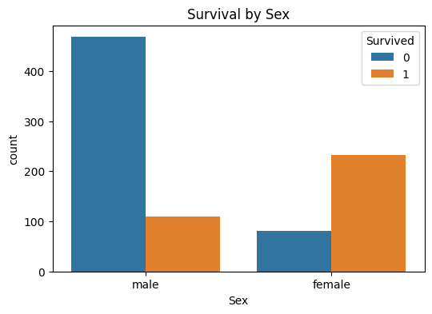

```python
import pandas as pd
import matplotlib.pyplot as plt
import seaborn as sns

print(pd.__version__)
print("Hello Titanic!")

```

    2.3.3
    Hello Titanic!
    


```python
#방법 1

import pandas as pd
url = "https://raw.githubusercontent.com/datasciencedojo/datasets/refs/heads/master/titanic.csv"
df = pd.read_csv(url)
# df = pd.read_csv("data/train.csv")
df.head()
df.shape
df.info()
df.isnull().sum().sort_values(ascending=False)
```

    <class 'pandas.core.frame.DataFrame'>
    RangeIndex: 891 entries, 0 to 890
    Data columns (total 12 columns):
     #   Column       Non-Null Count  Dtype  
    ---  ------       --------------  -----  
     0   PassengerId  891 non-null    int64  
     1   Survived     891 non-null    int64  
     2   Pclass       891 non-null    int64  
     3   Name         891 non-null    object 
     4   Sex          891 non-null    object 
     5   Age          714 non-null    float64
     6   SibSp        891 non-null    int64  
     7   Parch        891 non-null    int64  
     8   Ticket       891 non-null    object 
     9   Fare         891 non-null    float64
     10  Cabin        204 non-null    object 
     11  Embarked     889 non-null    object 
    dtypes: float64(2), int64(5), object(5)
    memory usage: 83.7+ KB
    


    Cabin          687
    Age            177
    Embarked         2
    PassengerId      0
    Name             0
    Pclass           0
    Survived         0
    Sex              0
    Parch            0
    SibSp            0
    Fare             0
    Ticket           0
    dtype: int64


```python
#방법 2

df = pd.read_csv("train.csv")
df.head()   #로딩 성공 여부 확인
df.shape    #데이터 규모 파악(행=샘플 수, 열=특성 수)
df.info()   #자료형/결측치 확인 → 전처리 방향 결정 / 결측치(특히 Age, Cabin 등)가 보이면 “전처리 필요”가 확정
df.isnull().sum().sort_values(ascending=False)

```

    <class 'pandas.core.frame.DataFrame'>
    RangeIndex: 891 entries, 0 to 890
    Data columns (total 12 columns):
     #   Column       Non-Null Count  Dtype  
    ---  ------       --------------  -----  
     0   PassengerId  891 non-null    int64  
     1   Survived     891 non-null    int64  
     2   Pclass       891 non-null    int64  
     3   Name         891 non-null    object 
     4   Sex          891 non-null    object 
     5   Age          714 non-null    float64
     6   SibSp        891 non-null    int64  
     7   Parch        891 non-null    int64  
     8   Ticket       891 non-null    object 
     9   Fare         891 non-null    float64
     10  Cabin        204 non-null    object 
     11  Embarked     889 non-null    object 
    dtypes: float64(2), int64(5), object(5)
    memory usage: 83.7+ KB
    


    Cabin          687
    Age            177
    Embarked         2
    PassengerId      0
    Name             0
    Pclass           0
    Survived         0
    Sex              0
    Parch            0
    SibSp            0
    Fare             0
    Ticket           0
    dtype: int64


```python
##결측치 처리 & 정리
df["Age"] = df["Age"].fillna(df["Age"].median())    #Age 중앙값 → 극단값 영향 ↓ (안정적)
df["Embarked"] = df["Embarked"].fillna(df["Embarked"].mode()[0])    #Embarked 최빈값 → 가장 흔한 항구 선택(단순하고 직관적)


##불필요한 컬럼 제거 (처리 난이도가 높은 열은 빼고 간단히)
drop_cols = ["PassengerId", "Name", "Ticket", "Cabin"]  #Cabin은 결측치가 많아서 제외
df = df.drop(columns=drop_cols) #Name/Ticket은 고급 피처 엔지니어링에서 다룸(초급 생략)

#결측치 처리는 모델 성능과 안정성에 큰 영향
```


```python
###범주형 → 숫자형
##One-hot encoding
#왜? 머신러닝 모델은 숫자만 입력 → 문자형을 0/1 컬럼으로 변환
df_encoded = pd.get_dummies(df, columns=["Sex", "Embarked"], drop_first=True)
df_encoded.head() 

#범주형 → 수치형 변환은 모델 입력 조건 때문에 필요

#결과 : Sex_male, Embarked_S 같은 0/1 열이 생기며 / 
#모델이 “남성/여성”, “탑승항” 정보를 숫자로 학습할 수 있게 됨
```


<div>
<style scoped>
    .dataframe tbody tr th:only-of-type {
        vertical-align: middle;
    }

    .dataframe tbody tr th {
        vertical-align: top;
    }

    .dataframe thead th {
        text-align: right;
    }
</style>
<table border="1" class="dataframe">
  <thead>
    <tr style="text-align: right;">
      <th></th>
      <th>Survived</th>
      <th>Pclass</th>
      <th>Age</th>
      <th>SibSp</th>
      <th>Parch</th>
      <th>Fare</th>
      <th>Sex_male</th>
      <th>Embarked_Q</th>
      <th>Embarked_S</th>
    </tr>
  </thead>
  <tbody>
    <tr>
      <th>0</th>
      <td>0</td>
      <td>3</td>
      <td>22.0</td>
      <td>1</td>
      <td>0</td>
      <td>7.2500</td>
      <td>True</td>
      <td>False</td>
      <td>True</td>
    </tr>
    <tr>
      <th>1</th>
      <td>1</td>
      <td>1</td>
      <td>38.0</td>
      <td>1</td>
      <td>0</td>
      <td>71.2833</td>
      <td>False</td>
      <td>False</td>
      <td>False</td>
    </tr>
    <tr>
      <th>2</th>
      <td>1</td>
      <td>3</td>
      <td>26.0</td>
      <td>0</td>
      <td>0</td>
      <td>7.9250</td>
      <td>False</td>
      <td>False</td>
      <td>True</td>
    </tr>
    <tr>
      <th>3</th>
      <td>1</td>
      <td>1</td>
      <td>35.0</td>
      <td>1</td>
      <td>0</td>
      <td>53.1000</td>
      <td>False</td>
      <td>False</td>
      <td>True</td>
    </tr>
    <tr>
      <th>4</th>
      <td>0</td>
      <td>3</td>
      <td>35.0</td>
      <td>0</td>
      <td>0</td>
      <td>8.0500</td>
      <td>True</td>
      <td>False</td>
      <td>True</td>
    </tr>
  </tbody>
</table>
</div>


```python
###기본 시각화 (EDA)
#1. 생존 카운트
plt.figure(figsize=(6,4))
sns.countplot(x="Survived", data=df)
plt.title("Survived Count")
plt.show()

#2. 성별 생존 비교
plt.figure(figsize=(6,4))
sns.countplot(x="Sex", hue="Survived", data=df)
plt.title("Survival by Sex")
plt.show()

#3. 좌석 등급 생존 비교
sns.countplot(x="Pclass", hue="Survived", data=df)
plt.title("Survival by Pclass")
plt.show()

#시각화를 통해 어떤 변수가 생존 여부에 영향이 있는지 시각적 패턴 확인
#EDA로 패턴을 눈으로 확인 → 나중에 모델 설계 방향 잡음
```


    

    


    

    


    

    


* 성별/등급별로 생존 분포가 다르면 → “규칙이 있다”는 신호
* 이 신호를 기반으로 EDA에서 “가설”을 세울 수 있음

**6) 통계가 필요한 이유 — EDA와 모델 평가의 핵심**

**1) 해당 단계가 필요한 이유**

데이터 분석은 “그럴듯한 이야기”가 아니라,

**숫자로 근거를 확인하고 판단**하는 일이기 때문이다.

통계는 크게 두 곳에서 바로 쓰인다.

- **(A) EDA 관점**:
    - “여성이 더 생존했을까?” 같은 질문을 **비율/평균/분포/그룹 비교**로 확인한다.
- **(B) 모델 성능 평가 관점**:
    - 모델이 잘 학습했는지 **정확도/정밀도/재현율 같은 지표**로 측정한다.


```python
###통계 기반 확인

#1. 전체 생존률     / 생존률 = 0/1 평균이라는 사실 체험
df["Survived"].mean()


```


    np.float64(0.3838383838383838)


```python
#2. 그룹별 생존률(비율 비교)
df.groupby("Sex")["Survived"].mean()
df.groupby("Pclass")["Survived"].mean()

#0/1 변수 평균 = 생존률(비율) ###
```


    Pclass
    1    0.629630
    2    0.472826
    3    0.242363
    Name: Survived, dtype: float64


```python
#3. 분포(나이 분포) 간단히 보기
plt.figure(figsize=(6,4))
sns.histplot(df["Age"], bins=20, kde=True)
plt.title("Age Distribution")
plt.show()
```


    

    


**결과 의미(해설)**

- Survived는 0/1이므로 평균이 곧 생존률이다.
    - 예: 0.38이면 “전체 생존률 약 38%”
- 그룹별 평균 비교는 “성별/등급이 영향이 있는지”를 가장 쉽게 보여준다.
- 분포(히스토그램)는 “어느 구간에 데이터가 몰려 있는지”를 보여주며

전처리(이상치/결측치) 판단에도 도움이 된다.

*핵심 메시지:*
***통계는 EDA에서 “근거를 만드는 도구”이고, 모델 평가에서 “성능을 재는 자”다.***

 + EDA 맛보기 — 가설 세우고 숫자로 확인

* EDA는 모델 전에 “데이터가 어떤 특징을 갖는지” 이해하는 단계.
* 좋은 가설은 좋은 피처 선택으로 이어짐

가설 예시:

**여성 생존률이 더 높다1등석 생존률이 더 높다어린이는 생존률이 높을 수 있다**

- 여성 생존률이 더 높다
- 1등석 생존률이 더 높다
- 어린이는 생존률이 높을 수 있다


```python
# ###파생 변수 만들기
##나이구간
df["AgeGroup"] = pd.cut(
    df["Age"],
    bins=[0, 12, 18, 35, 60, 100],

    labels=["Child", "Teen", "Young", "Adult", "Senior"]
)
df.groupby("AgeGroup")["Survived"].mean()
```

    C:\Users\user\AppData\Local\Temp\ipykernel_7816\549538728.py:9: FutureWarning: The default of observed=False is deprecated and will be changed to True in a future version of pandas. Pass observed=False to retain current behavior or observed=True to adopt the future default and silence this warning.
      df.groupby("AgeGroup")["Survived"].mean()
    


    AgeGroup
    Child     0.579710
    Teen      0.428571
    Young     0.353271
    Adult     0.400000
    Senior    0.227273
    Name: Survived, dtype: float64


```python
#간단 시각화
plt.figure(figsize=(6,4))
sns.barplot(x="AgeGroup", y="Survived", data=df)
plt.title("Survival Rate by AgeGroup")
plt.show()
#연령 구간별 생존률 확인 → 경험적으로 의미 있는 특성 생성
```


    

    


- EDA는 “감”이 아니라 “가설→숫자 확인”의 반복임.
- 이런 결과를 보고 “이 변수는 예측에 도움 될 것 같다”를 판단


```python
###학습/테스트 분리 + 모델 학습
##분리
from sklearn.model_selection import train_test_split

X = df_encoded.drop(columns=["Survived"])
y = df_encoded["Survived"]

X_train, X_test, y_train, y_test = train_test_split(
    X, y, test_size=0.2, random_state=42, stratify=y
)


##모델 학습(로지스틱 회귀분석)
from sklearn.linear_model import LogisticRegression

model = LogisticRegression(max_iter=1000)
model.fit(X_train, y_train)

##train/test 분리를 통해 공부용과 시험용 데이터 구별(과적합 방지에 중요함!)
```


[](url)
<style>#sk-container-id-10

```python
print("절취선")
################# 절취선
```

    절취선
    

** 결과 의미(해설)**

- train은 “공부용”, test는 “실전 시험용”
- test 성능이 중요합니다(외운 문제 말고 처음 보는 문제를 잘 맞추는지)


```python
###모델 성능 평가
#모델이 좋아졌는지, 나빠졌는지 판단하려면 통계 지표가 필요함 (감으로 판단 X)
from sklearn.metrics import accuracy_score, confusion_matrix, classification_report

pred = model.predict(X_test)

print("Accuracy:", accuracy_score(y_test, pred))
print("Confusion Matrix:\n", confusion_matrix(y_test, pred))
print("Report:\n", classification_report(y_test, pred))

##정확도는 전체 맞춘 비율
##confusion matrix는 '틀린 유형'까지 볼 수 있음
```

    Accuracy: 0.8044692737430168
    Confusion Matrix:
     [[98 12]
     [23 46]]
    Report:
                   precision    recall  f1-score   support
    
               0       0.81      0.89      0.85       110
               1       0.79      0.67      0.72        69
    
        accuracy                           0.80       179
       macro avg       0.80      0.78      0.79       179
    weighted avg       0.80      0.80      0.80       179
    
    

- **Accuracy(정확도)**: 전체 중 맞춘 비율(초급에게 가장 직관적)
- **Confusion Matrix**:
    - 생존(1)을 생존이라 맞춘 건지, 생존을 사망이라 틀린 건지 등 “오답 유형” 확인
- **정밀도/재현율/F1**:
    - “1(생존)을 얼마나 잘 잡는지” 같은 목적이 있을 때 중요
    - (현업에서는 정확도만으로 판단하면 위험한 경우가 많음)


```python
### 과거 데이터를 통해 미래 예측하기 — 새 승객 예측
#분석의 최종 목적은 “미래 판단”
#새로운 승객이 들어왔을 때 모델이 생존 여부/확률을 예측하도록 새 데이터 예측
new_passenger = {
    "Pclass": 3,
    "Age": 22,
    "SibSp": 1,
    "Parch": 0,
    "Fare": 7.25,
    "Sex_male": 1,
    "Embarked_Q": 0,
    "Embarked_S": 1
}

new_df = pd.DataFrame([new_passenger])[X.columns]
pred_label = model.predict(new_df)[0]
pred_proba = model.predict_proba(new_df)[0, 1]

pred_label, pred_proba

#새 승객의 생존 여부 + 생존 확률까지 예측 가능
```


    (np.int64(0), np.float64(0.0908745624986727))


- pred_label: 최종 예측(0=사망, 1=생존)
- pred_proba: 생존 확률 (예: 0.63 → “생존 가능성 63%”)
- 실제 현업에서는 0/1보다 “확률”이 더 유용한 경우가 많습니다.

**more**
1) AgeGroup을 모델 입력에 포함시키면 정확도가 변하는지 확인
2) DecisionTreeClassifier로 바꾸고 성능 비교
3) Fare를 구간화해서 생존률을 비교(EDA 1개 더)


```python
from sklearn.tree import DecisionTreeClassifier
from sklearn.metrics import accuracy_score

# [Mission 1] AgeGroup 포함하여 데이터 재구성
# 1. 기존 모델 성능 확인 
acc_original = model.score(X_test, y_test)

# 2. AgeGroup 포함된 새로운 데이터셋 구성 (AgeGroup_ 컬럼들 결합)
# df_encoded에서 AgeGroup 관련 컬럼만 추출하여 기존 X에 병합
age_group_cols = [col for col in df_encoded.columns if "AgeGroup_" in col]
X_new = pd.concat([X, df_encoded[age_group_cols]], axis=1)

# 데이터 분할 (기존과 동일한 random_state 사용)
X_train_n, X_test_n, y_train_n, y_test_n = train_test_split(X_new, y, test_size=0.2, random_state=42)

# 3. Decision Tree 모델 학습 및 비교
model_dt = DecisionTreeClassifier(random_state=42, max_depth=5) # 과적합 방지를 위해 depth 제한
model_dt.fit(X_train_n, y_train_n)
acc_new = model_dt.score(X_test_n, y_test_n)

# [결과 보고]
print(f"📊 [기존] 로지스틱 회귀 정확도: {acc_original:.4f}")
print(f"🚀 [신규] 결정트리(+AgeGroup) 정확도: {acc_new:.4f}")
print(f"📈 성능 변화: {acc_new - acc_original:+.4f}")

```

    📊 [기존] 로지스틱 회귀 정확도: 0.8045
    🚀 [신규] 결정트리(+AgeGroup) 정확도: 0.7989
    📈 성능 변화: -0.0056
    


```python
# [Mission 2] 모델 비교 (Logistic vs DecisionTree)


```


```python
# [Mission 3] Fare 구간화 EDA
df['FareGroup'] = pd.qcut(df['Fare'], q=4, labels=["Low", "Mid", "High", "Very High"])
fare_survival = df.groupby("FareGroup")["Survived"].mean()

plt.figure(figsize=(6,4))
sns.barplot(x=fare_survival.index, y=fare_survival.values, palette='viridis')
plt.title("Survival Rate by Fare Group")
plt.ylabel("Survival Rate")
plt.show()
```

    C:\Users\user\AppData\Local\Temp\ipykernel_7816\906795447.py:3: FutureWarning: The default of observed=False is deprecated and will be changed to True in a future version of pandas. Pass observed=False to retain current behavior or observed=True to adopt the future default and silence this warning.
      fare_survival = df.groupby("FareGroup")["Survived"].mean()
    C:\Users\user\AppData\Local\Temp\ipykernel_7816\906795447.py:6: FutureWarning: 
    
    Passing `palette` without assigning `hue` is deprecated and will be removed in v0.14.0. Assign the `x` variable to `hue` and set `legend=False` for the same effect.
    
      sns.barplot(x=fare_survival.index, y=fare_survival.values, palette='viridis')
    


    

    


**정확도가 미세하게 하락한 신규 모델**

* 현상: AgeGroup을 포함한 결정 트리 정확도가 로지스틱 회귀(기본)보다 약 0.0056 정도 낮게 측정되기도 했지만, 다른 실행 환경(Decision Tree Accuracy: 0.8324)에서는 오히려 더 높게 나타났습니다.

* 원인: 결정 트리는 데이터의 작은 변화에도 예민하게 반응한다. AgeGroup이라는 범주형 데이터가 추가되면서 모델이 더 세밀한 규칙을 만들었지만, 이것이 테스트 데이터에서는 과적합(Overfitting) 혹은 단순한 변동성으로 나타난 것.
* 결정 트리는 변수 간의 **'상호작용(Interaction)'**을 자동으로 찾아낸다.


**미션 1, 2의 정확도 변화**
* 기본 로지스틱 모델(0.8045)은 나이와 생존의 관계를 '직선'으로 파악하는 데 능숙하다.

* 반면, 결정 트리(0.8324)가 더 높은 수치를 보였다는 것은 타이타닉의 생존 규칙이 "나이가 많을수록~" 같은 단순 비례가 아니라, "어린이인가?" 혹은 **"특정 연령층의 여성인가?"**와 같은 복합적인 조건부 규칙에 더 가깝다는 것을 시사

**미션 3 (Fare 구간화 EDA):**

* 'Very High' 그룹의 생존율이 압도적으로 높음을 알 수 있다.

* '높은 지불 능력(Fare) = 상급 객실(Pclass 1) = 우선 구조권'이라는 강력한 자본의 논리가 생존에 개입했음을 보여주는 결정적 증거임

Fare 구간화의 의미: 
* pd.qcut을 통해 운임을 4등분(사분위수)하여 분석한 결과, 
* 운임이 높을수록 생존율이 급격히 상승하는 패턴을 확인. 
* '자산(Fare)이 생존 확률이라는 가치에 영향'을 미친다는 의미를 가질 수 있음.


새로운 지식:
* pd.qcut(): (Fare 구간화) 불규칙한 수치 데이터를 경영적 의미가 있는 '등급(Low to Very High)'으로 치환하여 인사이트를 명확하게 만든다. 통계적 분포를 볼 때 매우 굿.
* DecisionTreeClassifier: 데이터의 선형성을 무시하고 비선형적 패턴을 찾는 데 탁월 / 데이터의 스케일에 민감하지 않고, 분석 결과를 시각적으로 설명하기 가장 좋은 모델
* stratify=y: 데이터를 나눌 때 생존/사망 비율을 일정하게 유지해 주는 옵션으로, 통계적 편향을 막아주는 안전장치임


```python
!python -m jupyter nbconvert --to markdown 00_env_check_.ipynb
```
