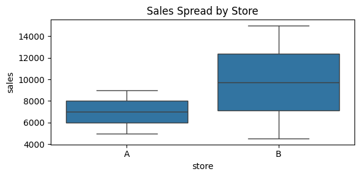

```python
###오늘 배울 내용 : Line / Bar / Scatter / Hist / Box

import pandas as pd
import numpy as np
import matplotlib.pyplot as plt
import seaborn as sns

### 1. 실습용 데이터
#전처리가 필요한 "현실 데이터" 상황을 만들기 위함
#날짜 형식 섞임, 문자열 숫자, 결측치 일부러 포함

raw = [
    {"date":"2026-01-01","store":"A","menu":"Americano","price":"4500원","qty":"2","paid":"TRUE"},
    {"date":"2026/01/01","store":"A","menu":"Latte","price":"5,000","qty":1,"paid":"True"},
    {"date":"2026-01-02","store":"A","menu":"Latte","price":None,"qty":2,"paid":"FALSE"},
    {"date":"2026-01-03","store":"B","menu":"Mocha","price":"5500","qty":None,"paid":True},
    {"date":"2026-01-03","store":"B","menu":"Americano","price":"4500","qty":1,"paid":"TRUE"},
    {"date":"2026-01-04","store":"B","menu":"Latte","price":"5000원","qty":"3","paid":"TRUE"},
]
df = pd.DataFrame(raw)
df.head()

```


<div>
<style scoped>
    .dataframe tbody tr th:only-of-type {
        vertical-align: middle;
    }

    .dataframe tbody tr th {
        vertical-align: top;
    }

    .dataframe thead th {
        text-align: right;
    }
</style>
<table border="1" class="dataframe">
  <thead>
    <tr style="text-align: right;">
      <th></th>
      <th>date</th>
      <th>store</th>
      <th>menu</th>
      <th>price</th>
      <th>qty</th>
      <th>paid</th>
    </tr>
  </thead>
  <tbody>
    <tr>
      <th>0</th>
      <td>2026-01-01</td>
      <td>A</td>
      <td>Americano</td>
      <td>4500원</td>
      <td>2</td>
      <td>TRUE</td>
    </tr>
    <tr>
      <th>1</th>
      <td>2026/01/01</td>
      <td>A</td>
      <td>Latte</td>
      <td>5,000</td>
      <td>1</td>
      <td>True</td>
    </tr>
    <tr>
      <th>2</th>
      <td>2026-01-02</td>
      <td>A</td>
      <td>Latte</td>
      <td>None</td>
      <td>2</td>
      <td>FALSE</td>
    </tr>
    <tr>
      <th>3</th>
      <td>2026-01-03</td>
      <td>B</td>
      <td>Mocha</td>
      <td>5500</td>
      <td>None</td>
      <td>True</td>
    </tr>
    <tr>
      <th>4</th>
      <td>2026-01-03</td>
      <td>B</td>
      <td>Americano</td>
      <td>4500</td>
      <td>1</td>
      <td>TRUE</td>
    </tr>
  </tbody>
</table>
</div>


* pandas: 데이터 다루기(전처리, 집계)
* numpy: 숫자 처리 보조
* matplotlib: 모든 그래프의 기본 엔진(축/제목/레이아웃 제어)
* seaborn: 통계형 그래프를 빠르고 예쁘게 그리기


```python
### 2. 전처리

    #시각화는 "그리기" 전에 반드시 데이터가 맞는지 검증해야 함
    #(전처리 결과를 시각화로 확인하는 것도 중요한 목적)

# 날짜
    # - 문자열 날짜를 datetime으로 변환
    # - 실패하면 NaT로 처리하여 이후 에러 방지
df["date"] = pd.to_datetime(df["date"], errors="coerce", format="mixed")

# price 문자열 → 숫자
    #"4500원", "5,000" 같은 형식 정리 
    #숫자로 변환 불가능하면 NaN
df["price"] = (
    df["price"].astype("string")
    .str.replace(",", "", regex=False)
    .str.replace("원", "", regex=False)
)
df["price"] = pd.to_numeric(df["price"], errors="coerce")

# qty 숫자화
    #문자열/결측 섞여 있으므로 숫자로 통일
df["qty"] = pd.to_numeric(df["qty"], errors="coerce")

# paid 컬럼 bool 통일
    #TRUE / True / False 등 섞인 값을 True / False로 통일
df["paid"] = (df["paid"].astype("string").str.upper() == "TRUE")

# 매출
    #매출 파생 변수
    #시각화용 핵심 지표
    #결측이 있으면 sales도 NaN이 됨 (의도된 결과)
df["sales"] = df["price"] * df["qty"]

df
```


<div>
<style scoped>
    .dataframe tbody tr th:only-of-type {
        vertical-align: middle;
    }

    .dataframe tbody tr th {
        vertical-align: top;
    }

    .dataframe thead th {
        text-align: right;
    }
</style>
<table border="1" class="dataframe">
  <thead>
    <tr style="text-align: right;">
      <th></th>
      <th>date</th>
      <th>store</th>
      <th>menu</th>
      <th>price</th>
      <th>qty</th>
      <th>paid</th>
      <th>sales</th>
    </tr>
  </thead>
  <tbody>
    <tr>
      <th>0</th>
      <td>2026-01-01</td>
      <td>A</td>
      <td>Americano</td>
      <td>4500</td>
      <td>2.0</td>
      <td>True</td>
      <td>9000.0</td>
    </tr>
    <tr>
      <th>1</th>
      <td>2026-01-01</td>
      <td>A</td>
      <td>Latte</td>
      <td>5000</td>
      <td>1.0</td>
      <td>True</td>
      <td>5000.0</td>
    </tr>
    <tr>
      <th>2</th>
      <td>2026-01-02</td>
      <td>A</td>
      <td>Latte</td>
      <td>&lt;NA&gt;</td>
      <td>2.0</td>
      <td>False</td>
      <td>&lt;NA&gt;</td>
    </tr>
    <tr>
      <th>3</th>
      <td>2026-01-03</td>
      <td>B</td>
      <td>Mocha</td>
      <td>5500</td>
      <td>NaN</td>
      <td>True</td>
      <td>&lt;NA&gt;</td>
    </tr>
    <tr>
      <th>4</th>
      <td>2026-01-03</td>
      <td>B</td>
      <td>Americano</td>
      <td>4500</td>
      <td>1.0</td>
      <td>True</td>
      <td>4500.0</td>
    </tr>
    <tr>
      <th>5</th>
      <td>2026-01-04</td>
      <td>B</td>
      <td>Latte</td>
      <td>5000</td>
      <td>3.0</td>
      <td>True</td>
      <td>15000.0</td>
    </tr>
  </tbody>
</table>
</div>


```python
### 3. Line Plot: 일별 매출 추이

# 질문 유형: 시간에 따른 변화(추이)
# → Line Plot 선택

# 핵심 포인트:
# 1) 날짜 기준으로 집계(groupby)
# 2) 날짜 정렬(sort_values)
# 3) 원본 그대로 그리지 않는다

daily = (
    df.groupby("date", as_index=False)["sales"]
    .sum()
    .sort_values("date")
)

plt.figure(figsize=(6,3))
plt.plot(daily["date"], daily["sales"], marker="o")
plt.title("Daily Sales Trend")
plt.xlabel("date")
plt.ylabel("sales")
plt.xticks(rotation=45)
plt.tight_layout()
plt.show()

# 해석 포인트:
# - 날짜가 뒤로 갈수록 매출이 증가/감소/변동하는지
# - 변화 원인이 price인지 qty인지 추가 분해 필요
```


    

    


```python
##4. Bar Plot: 메뉴별 매출 순위

# 질문 유형: 항목 간 크기 비교(순위)
# → Bar Plot 선택

# 핵심 포인트:
# 1) 메뉴별 집계(groupby)
# 2) 순위 비교를 위해 정렬(sort_values)

menu_sales = (
    df.groupby("menu", as_index=False)["sales"]
    .sum()
    .sort_values("sales", ascending=False)
)

plt.figure(figsize=(6,3))
sns.barplot(data=menu_sales, x="menu", y="sales")
plt.title("Sales by Menu (Rank)")
plt.tight_layout()
plt.show()

# 해석 포인트:
# - 매출 1등 메뉴 확인
# - 매출이 높은 이유가 가격인지 수량인지 추가 확인 가능
```


    

    


```python
### 5. Scatter Plot: 가격 vs 수량 관계

# 질문 유형: 두 변수 간 관계
# → Scatter Plot 선택

# 핵심 포인트:
# - x, y 둘 다 필요하므로 결측 제거 필수

tmp = df.dropna(subset=["price", "qty"])

plt.figure(figsize=(5,4))
sns.scatterplot(data=tmp, x="price", y="qty", hue="menu")
plt.title("Price vs Qty")
plt.tight_layout()
plt.show()

# 해석 포인트:
# - 가격이 높을수록 수량이 줄어드는지/늘어나는지
# - 표본이 적으므로 결론이 아닌 가설 수준
```


    

    


```python
### 6. Histogram: 매출 분포

# 질문 유형: 값이 어떻게 퍼져 있나(분포)
# → Histogram 선택

# 핵심 포인트:
# - sales 결측 제거
# - bins 개수에 따라 분포 인상이 달라짐

tmp = df.dropna(subset=["sales"])

plt.figure(figsize=(6,3))
plt.hist(tmp["sales"], bins=6)
plt.title("Sales Distribution")
plt.xlabel("sales")
plt.ylabel("count")
plt.tight_layout()
plt.show()

# 해석 포인트:
# - 매출이 특정 구간에 몰려 있는지
# - 일부 큰 값이 평균을 끌어올리는지 확인 가능
```


    

    


```python
### 7. Box Plot: 매장별 매출 분포

# 질문 유형: 이상치 / 범위 / 안정성 비교
# → Box Plot 선택

# 박스플롯이 보여주는 것:
# - 중앙값
# - IQR(중간 50%)
# - 이상치 후보

plt.figure(figsize=(6,3))
sns.boxplot(data=tmp, x="store", y="sales")
plt.title("Sales Spread by Store")
plt.tight_layout()
plt.show()

# 해석 포인트:
# - 어느 매장이 매출 변동이 더 안정적인지
# - 튀는 값이 특정 메뉴/수량 때문인지 추가 분석 가능
```


    

    


```python
!python -m jupyter nbconvert --to markdown 04_real.ipynb
```
